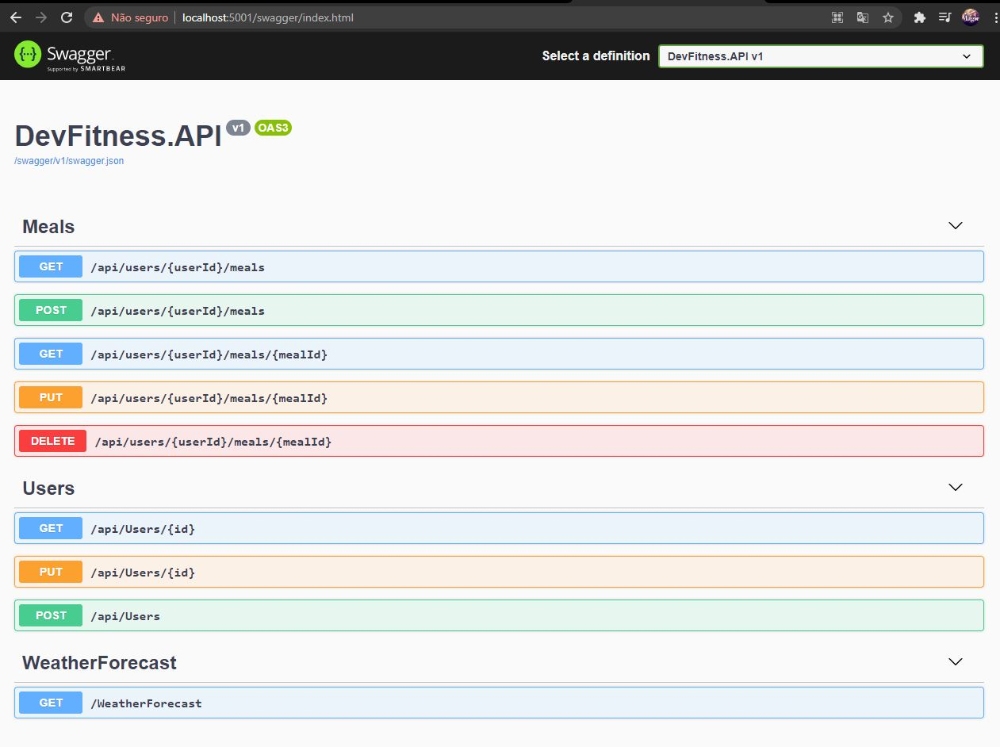

### Requisito
--Ter SqlServer e dotnet Core

### Comandos úteis 

--dotnet run

### link do swagger localhost

https://localhost:5001/swagger/index.html

### Comandos úteis para Entity FrameworkCore para BD

 --dotnet add package Microsoft.EntityFrameworkCore.SqlServer

### Amostra api via swagger

 
